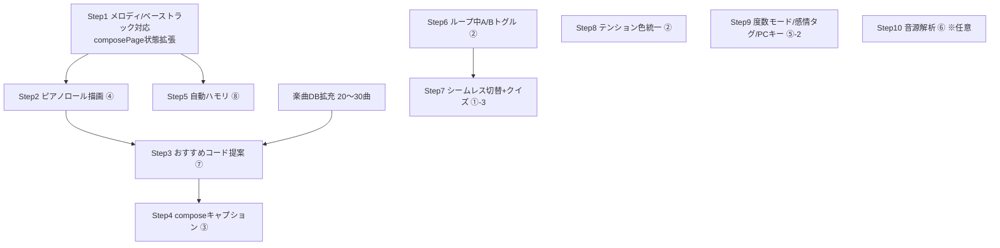

# 未実装機能まとめ & 実装フロー

作成日: 2026-07-15 ／ 対象: `app/`（企画書.md と現行コードの照合結果）

## 1. 実装状況サマリ

| 企画書の機能 | 状態 | 備考 |
|---|---|---|
| ① プリセット進行・移調・試聴 | ✅ 済 | 4進行、compose連携もあり |
| ①-2a 楽曲紐付け表示 | ✅ 済 | `songs.js`（曲数はまだ少ない） |
| ①-2b 逆引き検索 | ✅ 済 | 近似判定含む |
| ①-3 進行聴き比べページ | 🔶 部分 | 切替が「次ループ開始時」。シームレス切替・クイズ未 |
| ② テンション操作 | 🔶 部分 | トグル/A/B/メーター/積み上げ再生は済。ループ中A/B・「同じ音なのに」デモ・色の全ページ統一が未 |
| ③ リアルタイム解説 | 🔶 部分 | mainのみ。composeの進行キャプション未（`transitionCaption` は定義済みで未使用） |
| ④ ピアノロール刷新 | ✅ 済 (7/15) | 表示・クリック選択試聴・ドラッグ移動/移調・削除 |
| ⑤ 楽器音源追加 | 🔶 部分 | composeに選択UIあり。main/compare/learnはピアノ固定 |
| ⑤-2 度数モード / 感情タグ検索 / PCキーボード演奏 | ❌ 未 | 度数解析・tagsデータは既にある |
| ⑤-2 3トラック同時再生 | ✅ 済 (7/15) | `core/timeline.js` + composeで3トラック同時再生 |
| ⑦ おすすめコード提案 | ❌ 未 | マルコフ連鎖・3択UI・ホバー試聴 |
| ⑧ ハモリ体感 | ❌ 未 | 自動ハモリ・間隔実験室・種明かし |
| ⑥ 音源解析（優先度C） | ❌ 未 | 時間次第の扱い |

## 2. 実装フロー（依存関係順）

### フェーズ1: compose基盤（④の土台）— ✅ 完了（2026-07-15）

新規ファイル: `js/core/timeline.js`（3トラック状態・純粋関数）、`js/ui/pianoRoll.js`(描画コンポーネント)。selftestに9件のテスト追加済み。

**Step 1. トラック構造の拡張** ✅
- 対象: `js/pages/composePage.js`
- `timeline`（コードのみの配列）を `{ chord: [], melody: [], bass: [] }` の3トラック構造へ。再生は `playTracks()` に3トラック渡すだけ（エンジン側は対応済み）
- 完了条件: コード+ベースを重ねて再生でき、停止が効く

**Step 2. ピアノロール描画（④）** ✅
- 対象: `js/pages/composePage.js`、`css/style.css`、`compose.html`
- 縦=音高・横=カウントのグリッドに、追加したコードの構成音をブロック表示。上部に進行名（`chordDisplayName`）をリアルタイム表示。メロディ/ベースはサブトラック併記
- まずは「表示のみ」→ クリック削除 → ドラッグ移動の順で段階実装
- 完了条件: プリセット読込→ロール表示→編集→再生の一連が動く

### フェーズ2: 発表の目玉（⑦・③）

**Step 3. おすすめコード提案（⑦）**
- 対象: 新規 `js/data/transitions.js` + `composePage.js`
- `songs.js` の進行を `normalizeProgression` で度数化→遷移確率を集計（マルコフ連鎖）。直前コードから候補3つ＋性格ラベル表示、ホバーで `playNow` 試聴、クリックで追加
- 前提: `songs.js` を20〜30曲に拡充（verified運用ルール順守）
- 完了条件: 候補3つが確率順に出て、試聴→追加できる

**Step 4. composeのリアルタイム解説（③）**
- 対象: `composePage.js`、`captions.js`
- 未使用の `transitionCaption()` を接続し、コード追加時に「Am→Fは…」を表示。「もっと詳しく」は `learn.html#進行アンカー` へ
- 完了条件: 追加操作のたびにキャプションが更新される

### フェーズ3: 体感系（⑧・②残り・①-3残り）

**Step 5. 自動ハモリ（⑧）**
- 対象: `musicTheory.js`（3度下ハモ計算を追加）、`composePage.js`（トグル）、`learnPage.js`（2/3/5/6度の間隔聴き比べ）
- 完了条件: メロディにワンタップで3度下ハモが付き同時再生される

**Step 6. ループ中A/Bトグル＋「同じ音なのに」デモ（②）**
- 対象: `mainPage.js`、`audioEngine.js`（ループ再生ヘルパー追加）
- コードをループ再生しながらテンションON/OFF。D4/D5比較のデモボタン2つ
- 完了条件: 再生を止めずに響きだけが変わる

**Step 7. 聴き比べのシームレス切替＋クイズ（①-3）**
- 対象: `comparePage.js`
- 現在の「次ループで切替」を、カウント位置を引き継いだ即時切替に。余裕があれば進行当てクイズ
- 完了条件: 再生中の任意のタイミングでA/B切替できる

### フェーズ4: 磨き込み（優先度B）

**Step 8. テンション色の全ページ統一（②）**
- 対象: `style.css`、`mainPage.js`
- 現状 `tension-tone` が9th色一律（`!important`）。テンション種別ごとに `--tension-*` を割当て
**Step 9. 度数モード / 感情タグ検索 / PCキーボード演奏（⑤-2）**
- 度数表示切替は `degreeToRoman` 流用で低コスト。タグ検索は `progressions.js` の `tags` を使うだけ
**Step 10. 楽器音源をmain/compare/learnにも追加（⑤）**
- `loadInstrument()` に名前を渡すだけ。各ページにセレクト追加

### フェーズ5（任意・時間が余れば）

**音源解析（⑥）**: 独立モジュールとして `js/analysis/` に隔離。mp3/wavアップロード→クロマ特徴量→トライアド推定→ピアノロールへ読込。コアに影響させない

## 3. UIリデザイン（仮デザイン反映・2026-07-17）

「初心者向けなのに情報量が多すぎる」という課題認識から、learn.html（入門）と main.html（練習）の仮デザインを別途作成した。以下を新規Stepとして実装フローに組み込む。

**Step A. 入門ページ：ステップ通しUI（learn.html or 新規）** ✅ 実装済み（2026-07-17・tutorial.html）
- 1画面1概念（ボタン1〜2個＋鍵盤ハイライト＋短いヒント＋折りたたみ式「もっと詳しく」）の7ステップ構成に刷新
- 上部のステップフローバー（アイコン列）をクリックすると任意のステップへ直接ジャンプできる（＝スキップ操作を兼ねる。専用スキップボタンは不要）
- 最終ステップに「練習モードで音をさわる→」「作曲モードをのぞく→」の卒業CTAを設置し、mainPage / composePageへ導線を張る
- 完了条件: 7ステップを行き来でき、各ステップの音声再生とキャプション表示が動く

**Step B. 練習ページ：音の積み木タワーUI（main.html）** ✅ 実装済み（2026-07-17・index.html/mainPage.js、musicTheory.jsにnoteRole()追加）
- 左側の選択パネル（基礎音・調号・コードタイプ・オクターブ等、既存のボタン構成）は維持する
- 右側の「音を聴く・確認する」プレビュー部分を、音を1つずつ積み上げるタワー表示（ブロックが積み重なり、コード名と響きの一言解説がリアルタイム更新）に差し替える
- **重要な設計変更点**: 仮デザインの `STACK`（ルート/3度/5度/7th/9th/13thの音・役割）はCキー固定のハードコードだったが、本実装では左パネルで選んだ基礎音・コードタイプに応じて `musicTheory.js` の計算結果から毎回動的に生成する。積み木＝固定デモではなく、選択中のコードに追従する本番UIとして組み込む
- ブロックの色分け（役割ごとの色）は②のテンション色統一ルールと揃え、鍵盤ハイライトにも同じ色を使う
- 完了条件: 任意の基礎音・コードタイプを選んでも、積み木タワーと鍵盤ハイライトが連動して動く

**Step C. ダーク/ライトテーマの全ページ対応** ✅ 実装済み（2026-07-17・js/core/theme.js、style.cssに[data-theme="dark"]変数セット追加）
- 入門ページの仮デザインにある月/太陽ボタンの切り替え（`state.theme` トグル）の仕組みをアプリ全体に拡張する
- 色は `--bg` `--surface` `--accent` `--text` などのCSSカスタムプロパティで一元管理し、`style.css` にダーク用の値セットを追加。テーマ状態はページをまたいでも保持する（localStorage等）
- 入門＝ライト、練習＝ダークのような固定割当てではなく、どのページでもユーザーがトグルで切り替えられる状態を最終形とする
- 完了条件: 任意のページでテーマ切替ボタンを押すと配色が変わり、他ページに遷移しても選択したテーマが維持される

## 4. 進め方の指針

- 各Stepは「実装 → `node app/tests/selftest.mjs` にロジックのテスト追加 → ブラウザ確認」の順で完結させる（README の設計ルール5原則を維持）
- フェーズ1→2が発表デモの軸（プリセット→ピアノロール→提案→解説）。3以降は進捗次第で取捨選択
- 企画書のスケジュール上、今日(7/15)は第1週相当。フェーズ1を今週中に終えるのが目安
